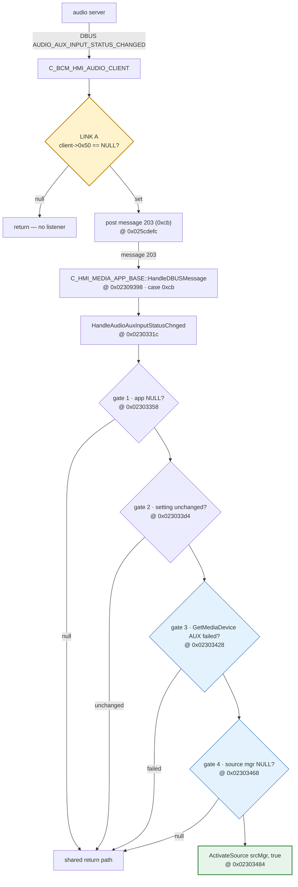

# The AUX chain

How the unit chooses AUX: at boot, where the `C_MGR_SRC` source scheduler restores a saved
source, and afterwards, where the media app's AUX handler asks for it. Every address is in the
`NAV` `SMEG5.43.A.R2` image; **executed** means run under [the emulator](EMULATION.md) or
observed on the car, as marked.

!!! success "Current state"

    * **Boot to AUX works on hardware.** `aux-autoswitch` + `aux-boot-default` + the three-edit
      `aux-boot-restore` boot the unit to AUX; neither boot set works alone. `builds/aux-boot.json`
      is the minimal build. The car evidence is summarised [below](#evidence-from-the-car) and
      logged in [Hardware verification](VERIFICATION.md#later-car-tests).
    * **Stock firmware has no switch-on-signal.** The AUX handler reacts to the saved AUX input
      *setting*, not to audio arriving; see
      [What the handler actually reacts to](#what-the-handler-actually-reacts-to).
      `aux-signal-switch` adds one, is verified under emulation only, has **not** been flashed,
      and is not being pursued; see [The AUX signal path](AUX_SIGNAL.md).

## How the boot source is actually chosen

Read from the NAV image; the runtime evidence is the user spy archives listed in
[Evidence](#evidence-from-the-car) (2026-09-14 is an unpatched boot). Each step carries its tier.

**`Init` runs before `StartUp`.** *Inferred from the code.* Both are `C_MGR_SRC` virtuals, at
vtable slots `0x0307aa6c` and `0x0307aa74`. `Init` creates the lock at `+0x80`, and `StartUp`
takes that lock before it restores anything. `Init` also writes `+0xb4 = 1` and `+0xac = 1`
unconditionally (`0x016995b0`–`0x016995b8`), so whatever `StartUp` restores lands on top.

**`StartUp` restores two keys, logs one, then starts a timer.** *Read.*

* It reads `Last_Source_Priority` into `+0xac` (`0x01699448`), and `Last_Source` into `+0xb4`
  (`0x01699490`), mirroring it to the global `0x035e4cd0` and into `+0xe4`. Neither value is
  validated. The key names are the strings at `0x0300a578` and `0x0300a584`.
* It logs `Last_Source` with the **saved** value (`lwz r5,8(r1)` passed to `WriteMgrSrcSpy` at
  `0x01699488`) *before* the store at `0x0169948c`, which is the site `aux-boot-default`
  replaces. So the spy line `Last_Source : n` always shows what was saved, never the patched
  value.
* It starts a 7.5 s timer (`0x1d4c` ms). Its callback, `Mgr_src_SCHED_INIT_TIMEOUT`, reaches
  `SchedulerInitTimeout` through a private message (`HandlePrivateMessage+0x1bc`).

**Until that timer fires, the first allocation pass ignores `+0xb4`.** *Read.*
`ExecuteAllocationFirstRound` (`0x016957ec`) branches on a mode word at `0x035e4cd4`, which
`SetCurrentStatus` (`0x01695424`) sets to 1 in the normal case (not locked, `+0x7c` clear). In
mode 1 the `+0xb4` match (`0x01695b84`, reading at `0x01695b90`) runs only when the byte at
`this+0x3c0` is non-zero. That byte is 0 from the constructor and `Init`; `SchedulerInitTimeout`
sets it, and four sites in `AddRequest` set or clear it. Allocation is reached only through
`ExecuteAllocation`, from request and scheduler paths; `StartUp` never enters it.

**A saved source is restored only through the `ScheduledInit` path in `AddRequest`.** *Read* —
disassembly, confirmed against Ghidra's decompilation of `AddRequest` (`0x0169815c`). A type-5
or type-6 request is first added to the list at `+0xd4` (jump table at `0x02f4b080`), the list
the first pass matches against. Then, **only if the request's byte at `+0x28` (`PrOnly`) is
clear** (`0x0169846c`–`0x01698474`):

| the request's `(Sched_Pos, priority)` pair… | effect |
|---|---|
| is already in the `ScheduledInit` table at `+0x370` (`IsInitialized`) | cancels the init timer, sets the flag, `ForceSchedulerPosition(Sched_Pos)` — a source that asks again after boot is switched to straight away |
| is new | `SetScheduledInit` adds it to the table. If it also equals (`+0xb4`, `+0xac`) — i.e. (`Last_Source`, `Last_Source_Priority`) — the init timer is cancelled and the flag set. Then `ExecuteAllocation` runs, and the first pass matches `+0xb4`: **this is the restore** |

A request with `PrOnly` set skips all of that and goes straight to `ExecuteAllocation`: it never
enters the table and can never be restored. Type-4 requests take a separate branch with the same
table-and-compare logic but are never added to a request list. The request's type is the field
at request `+0x14`, the spy line's `Type=` (format string at `0x0300a63c`).

**If nothing matches in time, the timer picks FM.** *Read.* `SchedulerInitTimeout` calls
`ChangeToNextSchedulerPosition(0, 0)`. If that finds an eligible request in the list at `+0xd4`,
it moves the old `+0xb4` into `+0xe4`, stores a literal **1** into `+0xb4`
(`0x01697b44`–`0x01697b48`) and runs allocation. Position 1 is `POS_TUNER`. If it finds none, the
flag is cleared and a 5 s retry timer is started. The position it computes before storing 1 is
discarded, and would be the *highest* queued position, so patching the literal does not help; it
is also what `C_SRV_AUDIO::bcm_ActivateNextSource` calls, so the edit would change normal source
cycling. Releasing the current source already tries the **previous** position first. Both are
in [The source scheduler](SCHEDULER.md#changetonextschedulerposition-in-full).

**AUX's stock request has `PrOnly` set, so AUX never enters the table.** *Executed* — the
2026-09-14 spy request-list dump, whose last column is the byte at `+0x28`:

```
Nb|src|id|Status|Norm|NoSr|Lock|Type|sche|Post|Susp|PrOnly|
 1|0xa   |0xbc00   |WAITING|  10| 254| 254|   5|   1|   1|   1|   0|  false|
 2|0x3   |0x17400  |WAITING|  20| 254| 254|   5|   9|   0|   1|   1|  false|
 5|0x3   |0xe200   |ACKNOWL|  20| 255| 255|   5|   7|   0|   1|   1|  true|
```

The rows are the tuner (`0xbc00`, position 1), USB (`0x17400`, position 9) and AUX (`0xe200`,
position 7). AUX's priority (`Norm`) is **20**, and AUX is the only request with `PrOnly` true.
Every source whose request has `PrOnly` false has a `ScheduledInit` row (columns
`PNormal | SchedPos`), and AUX has none:

```
m_Mgr_src_ScheduledInit[0] ->  10 |   1 |POS_TUNER
m_Mgr_src_ScheduledInit[1] ->  20 |   9 |POS_USB
m_Mgr_src_ScheduledInit[2] ->  10 |  10 |POS_IPOD
m_Mgr_src_ScheduledInit[3] ->  10 |   8 |POS_BT
m_Mgr_src_ScheduledInit[4] ->  10 |   4 |POS_CDC
```

On that unpatched boot *(executed, ms since boot)* the tuner was granted at 10221 ms, about
3.7 s after `Last_Source` (1) was read — inside the 7.5 s window, so by the restore, not the
timer. AUX's request waited until AUX was selected by hand at 25789 ms:

```
6511::Last_Source   : 1 (0x1)
9727::AllocateSource  : MsgSrc = 10, SrcId= 0xbc00,Type=5, Sched_Pos= 1, ...
10062::AllocateSource  : MsgSrc = 3, SrcId= 0xe200,Type=5, Sched_Pos= 7, ...
10062::SendWAIT [MsgSrc + Source_ID]  : 3, 0xe200
10221::SendACK [MsgSrc + Source_ID]  : 10, 0xbc00
25789::ActivateSourceID::p_source_ID   : 57856 (0xe200)
```

The settings dump taken after that selection holds `Last_Source = 7` and
`Last_Source_Priority = 20`, exactly AUX's pair. So **stock firmware cannot resume AUX** after
you switch off on AUX: the saved values are right, but AUX's request is excluded by `PrOnly`
before the comparison. *Inferred* from the path and the executed values.

**Where `PrOnly` comes from.** *Read* — Ghidra decompilation and disassembly. The HMI's
`C_HMI_SrcMgntBase` keeps its request at `this+0x10`, so the `PrOnly` byte is `this+0x38`.
`ActivateSource(bool)` writes its argument there for the one `AllocateSource` it sends, then puts
the old value back. Two AUX sites pass `true`:

* `C_HMI_MEDIA_APP_BASE::InitApp` (`li r4,1` at `0x022c0678`) sends AUX's **boot** request. It is
  the only one of `InitApp`'s six activations that passes `true`, identified by the label it opens
  with, `user_HMI.AUX.Equalizer_aux`. The order of the boot requests (USB, iPod, BT, CDC, AUX) is
  `InitApp`'s order.
* `HandleAudioAuxInputStatusChnged` (`li r4,1` at `0x02303474`) sends it when the AUX input
  setting becomes non-zero ([below](#what-the-handler-actually-reacts-to)).

The video app passes `true` as well (`HandleMediaStateReady`, `HandleVideoTrackFound`). Inside
`C_MGR_SRC`, the byte is read only by `AddRequest`'s restore gate and by `AllocateSource`'s spy
line. Every call site and its argument is in [How HMI apps request sources](HMI_SOURCES.md).

## The boot-to-AUX patches

Three patch sets, NAV only, all needed; `builds/aux-boot.json` applies exactly these.

| set | site | original | patched | effect |
|---|---|---|---|---|
| `aux-autoswitch` | `0x02247858` `IsAUXSRCAvailable` | `9421ffa0` | `li r3,1; blr` | AUX stays a valid, selectable source (confirmed on hardware) |
| `aux-autoswitch` | `0x02303428` handler gate 3 | `419e014c` | `nop` | **no effect**: the gate never fires (executed, [below](#the-four-gates-in-the-handler)); kept so the bytes match the confirmed build |
| `aux-boot-default` | `0x0169948c` in `StartUp` | `81210008` `lwz r9,8(r1)` | `39200007` `li r9,7` | the restore target `+0xb4` is always `POS_AUX` (7), whatever was saved |
| `aux-boot-restore` | `0x022c0678` in `InitApp` | `li r4,1` | `li r4,0` | AUX's **boot** request is sent with `PrOnly` clear, so it enters the table and meets the restore |
| `aux-boot-restore` | `0x02303474` in the handler | `li r4,1` | `li r4,0` | the same for AUX's later requests (the once-per-boot re-announcement and setting changes); no other source changes |
| `aux-boot-restore` | `0x01699444` in `StartUp` | `lwz r0,8(r1)` | `li r0,20` | the restored `Last_Source_Priority` is always AUX's 20 |

`PrOnly` is cleared at AUX's two call sites rather than by removing the gate in `AddRequest`
(`nop` at `0x01698474`), which emulated identically but would also change the video sources.

**Emulated** (`tools/ppcemu.py`, NAV image; `AddRequest` run for real on a synthetic `C_MGR_SRC`
whose `+0xb4`/`+0xac` hold (7, 20) and whose init timer exists; `memcpy`, the node allocator,
`wdCancel`, `ExecuteAllocation` and `ForceSchedulerPosition` stubbed), fed AUX's request (type 5,
position 7, priority 20). The same runs are in `tests/test_firmware_nav.py`:

| request | `ScheduledInit` | restore flag `+0x3c0` | init timer cancelled |
|---|---|---|---|
| `PrOnly` set (stock AUX) | empty | 0 | no |
| `PrOnly` clear | `(7, 20)` | **1** | **yes** |
| `PrOnly` clear, but `+0xac` = 10 (priority edit absent) | `(7, 20)` | 0 | no |
| `PrOnly` clear, second request with `(7, 20)` already in the table | — | — | `ForceSchedulerPosition` reached |

The handler edit (`0x02303474`) was executed in the `aux-signal-switch` handler runs: with it,
the activation passes `PrOnly` 0 ([Emulation results](AUX_SIGNAL.md#emulation-results)).

**Beyond boot**, a *second* AUX request is forced to the front (`IsInitialized` →
`ForceSchedulerPosition`, emulated above). The handler sends one only when the AUX input
**setting** goes from zero to non-zero, so turning the AUX input on in the menu selects AUX
(*inferred*); audio arriving does not.

## Evidence from the car

Each flash is logged in [Hardware verification](VERIFICATION.md#later-car-tests); the captures
were read with `tools/spy_read.py`.

### What the first car test established

2026-09-27, `aux-autoswitch` + `aux-boot-default`: the unit booted to **FM** with audio playing
into AUX *(observed)*. `aux-boot-default` is applied and correctly located (`39200007` at
`0x0169948c` inside `C_MGR_SRC::StartUp`, `0x016990b8`–`0x016994a4`), and AUX was visible and
selectable. So forcing the restore target alone is not enough: AUX's request never reaches the
comparison.

### What the second car test established

2026-09-28, `aux-boot-restore` with the handler edit only: still **FM**. The capture *(executed)*:

```
8847::Last_Source   : 7 (0x7)
10109::AllocateSource  : MsgSrc = 3, SrcId= 0xe200,Type=5, Sched_Pos= 7, ...
10438::AllocateSource  : MsgSrc = 10, SrcId= 0xbc00,Type=5, Sched_Pos= 1, ...
16347::SendACK [MsgSrc + Source_ID]  : 10, 0xbc00
 3|0x3   |0xe200   |WAITING|  20| 255| 255|   5|   7|   0|   1|   1|  true|
```

AUX's boot request still had `PrOnly` true and `ScheduledInit` had no position-7 row, because the
boot request comes from `InitApp`, not the handler. FM was chosen by the init timer: 8847 +
7500 = 16347 ms, the tuner's ACK. AUX's request arrived 1.3 s into the window, in time to match
had `PrOnly` been clear. (`Last_Source : 7` is the saved value; that session had ended on AUX.)

### What the third car test established

2026-09-28, the three-edit `aux-boot-restore` + `aux-boot-default`: **booted to AUX three times**
*(observed)*. The capture of the last boot *(executed)*:

```
 6531 ms  saved Last_Source = 1
10228 ms  request  SrcId 0xe200   pos 7   type 5  PrOnly false   <- AUX
10228 ms  SendACK  SrcId 0xe200
ScheduledInit: POS_TUNER (1, 10), POS_USB (9, 20), POS_IPOD (10, 10), POS_BT (8, 10), POS_CDC (4, 10), POS_AUX (7, 20)
verdict: AUX was acknowledged first, at 10228 ms
```

AUX's boot request carries `PrOnly` false, enters `ScheduledInit` as (7, 20), and is acknowledged
in the same millisecond it asks, with no tuner ACK at the 7.5 s mark. The saved `Last_Source` was
1, so `aux-boot-default`'s override is what the request matched. Why the saved value was 1 after
three AUX boots is *not known*; when `C_MGR_SRC` saves the source is described in
[the scheduler](SCHEDULER.md).

## The AUX input handler

The path from the audio server to `ActivateSource` for AUX:



**LINK A** (amber) is the only link never observed; it depends on runtime state. **Gates 3 and
4** (blue) never fire (executed). The same trace as a call listing:

```
audio server
  --DBUS AUDIO_AUX_INPUT_STATUS_CHANGED-->  C_BCM_HMI_AUDIO_CLIENT
                      if (client->0x50 == NULL) return;        <-- LINK A: no listener
                    post internal message 203 (0xcb)           @ 0x025cdefc
  --message 203-->  C_HMI_MEDIA_APP_BASE::HandleDBUSMessage    @ 0x02309398
                      case 0xcb                                @ 0x02309638 -> 0x02309fbc
  --direct call-->  HandleAudioAuxInputStatusChnged            @ 0x0230331c
                      gate 1  app = this->0x50df4, NULL?       @ 0x02303358
                      gate 2  setting unchanged?               @ 0x023033d4
                      gate 3  GetMediaDevice(AUX) failed?      @ 0x02303428
                      gate 4  source manager NULL?             @ 0x02303468
                    ActivateSource(srcMgr, true)               @ 0x02303484
```

### Link A — the listener

`C_BCM_AUDIO_CLIENT::AUDIO_AUX_INPUT_STATUS_CHANGED` (`0x025c9e78`, the **input**-setting
notification) posts message 203 only if something registered for it:

```c
void C_BCM_AUDIO_CLIENT::AUDIO_AUX_INPUT_STATUS_CHANGED(client) {   // 0x025c9e78
    if (client->0x50 == NULL) return;       // 0x025c9e9c
    Post203(client->0x50);                  // 0x025cdefc
}
```

`client->0x50` is written by one setter (`0x025c97f0`), called from two places, both of which
return early when `app->0xc` is NULL:

```c
if (app->0xc == NULL) return;           // no proxy, no registration
SetListener(app->0xc, app);
```

So the listener exists only if `app->0xc` does, and **that same `app->0xc` is what the AUX
setting query dereferences** (`0x025cb280`), returning `-1` without touching its out-param when
it is null — a return value gate 2 discards. `app` is `mediaApp->0x50df4`, assigned at
`0x022bc4e8` from a DBUS client factory (`0x025fc3e8`) called as `Create(3, 0xc8, this)`; the
factory has several paths that return NULL, and needs a DBUS connection when the media app
initialises. Whether any of them is taken on a real unit is **not known**: it depends on runtime
state no static reading settles.

### The four gates in the handler

Recovered by executing the function:

```c
void HandleAudioAuxInputStatusChnged(this) {       // 0x0230331c
    app = this->0x50df4;                           // 0x022ad2c0 — a plain getter
    if (app == NULL) return;                       // gate 1  @ 0x02303358
    ctor(&obj);                                    // 0x02368080 — zeroes obj entirely
    Get_aux_status(app, &setting);                 // 0x025cb258 — RETURN VALUE DISCARDED
    state = (setting != 0);                        // the saved AUX input setting
    if (state == this->0x51449) return;            // gate 2  @ 0x023033d4
    this->0x51449 = state;
    if (GetMediaDevice(mgr, AUX, &obj)) return;    // gate 3  @ 0x02303428
    SetMediaDeviceState(mgr, AUX, 2);              // 0x022f388c
    if (obj[0x10] == NULL) return;                 // gate 4  @ 0x02303468
    ActivateSource(obj[0x10], true);               // 0x0273a248
}
```

| gate | tests | status |
|---|---|---|
| 1 | the audio client exists | **not known** — link A |
| 2 | the saved AUX input setting changed between zero and non-zero | **a real gate** — acts only on a transition |
| 3 | `GetMediaDevice(AUX)` succeeded | **never fires** — executed |
| 4 | the device carries a source manager | **never fires once gate 3 passes** — executed |

**Gate 2 is a change detector on the AUX input setting**, cached at `this+0x51449`. A setting
already non-zero when the state is first recorded produces no activation. Because the query's
return value is thrown away, a *failed* query reads as "setting 0": a broken link A and an AUX
input switched off in the menu are indistinguishable here. When the setting goes to zero, the
handler releases the source.

**Gate 3 never fires.** The AUX media device is registered unconditionally at start-up, so
`GetMediaDevice(AUX)` succeeds. *Executed:* running the registration function fills the table
with types `{0, 1, 2, 3, 5}`. **Gate 4** could not be bypassed by removing gate 3 either:
`GetMediaDevice` writes nothing to its out-param when it fails, so the field gate 4 tests stays
the zero the constructor left. The truth table is in [Emulating the firmware](EMULATION.md).

!!! danger "Do not nop gate 4"

    `0x0230346c` loads that field straight into `r3` as `ActivateSource`'s `this`. Removing
    the guard calls a C++ method on a null pointer, on the HMI thread.

Every exit path reaches the handler's own log call on the shared return path *(executed)*, but
this build's `Log_msg` sink is stubbed; the spy collect is the way to observe it
([Cheatcodes](CHEATCODES.md#a-module-dump-reaches-the-spy-not-the-dead-log-sink)).

## What the handler actually reacts to

The handler follows the saved **AUX input setting**, not audio arriving on the input. *Read*
from the disassembly:

* `C_MODULE_AUDIO::Get_aux_status` (`0x013b9c8c`) returns `lwz r0,0x8c(r31)` whenever the
  module's lifecycle state `+0x74` is non-zero.
* The only writers of that field on the module object are `setAUXGain` (`0x013bba28`,
  `stw r30,0x8c(r29)`, the setting it was given) and `read_sqlite_AudioUserData`
  (`0x013caba8`), which loads the user key `Auxiliary_Status`; the string is in the image.
* So `+0x8c` is the AUX input setting from the media options menu, 0..3. Signal presence is a
  different call, `Get_AUX_signal_status`, which reads the radio front-end
  ([The AUX signal path](AUX_SIGNAL.md)).

Which notification reaches the handler, *read*: `C_BCM_HMI_AUDIO_CLIENT`'s
`AUDIO_AUX_INPUT_STATUS_CHANGED` posts HMI message `0xcb` (`li r4,0xcb` at `0x025cdf1c`), and
`AUDIO_AUX_SIGNAL_STATUS_CHANGED` posts `0xcc` (`li r4,0xcc` at `0x025cded0`). The media app
dispatches the handler on `0xcb` and has no `0xcc` case; the audio app uses `0xcc` only to refresh
its menu.

When the setting notification is raised, *read* (see [The audio module](AUDIO_MODULE.md)):

* when the setting is written from the menu (`Set_aux_status` → `setAUXGain`);
* **once per boot**, at the end of `ElabRADIO_READY_FOR_INIT_0`, which calls
  `setAUXGain(+0x8c, 1)`. Whether the media app is listening by then is **not known**.

What follows:

* **Stock firmware has no path that switches to AUX because a signal appeared.** For the media
  dispatch this is *executed*: the stock window sends `0xcc` to its default case
  ([Emulation results](AUX_SIGNAL.md#emulation-results)). For the whole image it is *inferred*
  from the routing, since other paths are not exhaustively excluded. AUX greying out and
  re-enabling with the signal on the car is `IsAUXSRCAvailable()` in the audio app, a separate
  path.
* **`aux-autoswitch` does not produce an automatic switch.** Its first edit,
  `IsAUXSRCAvailable()`, keeps AUX selectable (confirmed on hardware); its second removes gate 3,
  which never fires, and the handler would act on a *setting* change in any case.
* **A signal-triggered switch needs new wiring**: route `0xcc` into the media app's AUX handler
  and make the handler test `Get_AUX_signal_status`. That is `patches/aux-signal-switch.json`,
  executed under emulation, not flashed; the detection path, its constraints and the emulation
  results are in [The AUX signal path](AUX_SIGNAL.md).
* **`aux-boot-restore` does not depend on this handler at boot.** Its boot edit is in `InitApp`;
  its handler edit covers the once-per-boot re-announcement and later setting changes.

## The media device table

`GetMediaDevice` and its neighbours operate on a fixed array hanging off the media app at
`this+0x50e60`:

```
mgr + 0x00 + n*0x20   device record n, 6 slots
mgr + 0xc0            how many are in use
```

Each 32-byte record holds its type at `+0x00` and its source manager at `+0x10`:

| function | address | behaviour |
|---|---|---|
| `FindDevice(mgr, type)` | `0x022f3608` | linear scan of the first `mgr[0xc0]` slots; returns the record or NULL |
| `GetMediaDevice(mgr, type, out)` | `0x022f3750` | `FindDevice`, then field-by-field copy into `out`; returns 0, or **-1 writing nothing** |
| `AddDevice(mgr, src)` | `0x022f3ad0` | append; refuses when `mgr[0xc0] > 5` |

Registration runs once, from media-app init (`0x022bf934` → `0x022b833c`), and is
unconditional — every early-out branch in the caller rejoins before the call. It registers types
0, 1, 2, 3 and 5 outright, then type 4 only if the byte at `this+0x51450` is set.

**AUX is media device type 5.** Every `GetMediaDevice`/`SetMediaDeviceState` call site that
passes type 5 — `0x02303404`, `0x02303450`, `0x02303564` — is inside the AUX handler, and no other
function uses it. Type 4, the only other candidate, is used by unrelated call sites and gated on a
byte written in exactly two places, both constructors, both storing 0, so it is never registered.
*(Inferred from the call sites, strongly.)*

### Six source numberings, and which one `Last_Source` uses

The source enums overlap numerically; never carry a value from one into another.

| numbering | where it comes from | AUX is |
|---|---|---|
| media device type | the table `GetMediaDevice` searches | **5** |
| HMI source | `OnEventSelect*` → `CreateNotificationCommand` | **7** |
| audio module `SRC_*` | the name table at `0x02f9d60c`, printed as `Current_source` | **5** |
| `C_MGR_SRC` scheduler position (`POS_*`) | `AllocateSource`'s `Sched_Pos` field and the SPY dump's switch | **7** |
| `C_MGR_SRC` request `SrcId` | `AllocateSource`'s `SrcId` field | **`0xe200`** (executed, 2026-09-14 spy archive); observed values are `0xba00`, `0xbc00`, `0xc000`, `0xe200`, `0x17400`, `0x1e200`, `0x1e600` |
| screen position | `GetSourceAtPosition`, 0-based | **4** |

The audio module's table is contiguous from `SRC_NO_SOURCE = 0`:

```
0 SRC_NO_SOURCE   1 SRC_TUNER   2 SRC_CD    3 SRC_MP3      4 SRC_CDC
5 SRC_AUX         6 SRC_PHONE   7 SRC_TTS   8 SRC_TA_PTY   9 SRC_TTS_ON_AUX
10 SRC_AUX_CONVERGENCE  11 SRC_BLUETOOTH  12 SRC_MTB  13 SRC_MLDIPO_RECO_PHONE
```

`C_MGR_SRC`'s own position enum is read from the switch in its SPY dump (`0x0169a2e4`, on a
per-source field at `+0x370`), not from the order of the string literals, where `POS_AUX` sits
between `POS_MP3` and `POS_BT`:

| value | name | value | name |
|---|---|---|---|
| `0` | `POS_NULL` | `6` | `POS_VIDEO` |
| `1` | `POS_TUNER` | `7` | `POS_AUX` |
| `2` | `POS_1CD` | `8` | `POS_BT` |
| `3` | `POS_MP3` | `9` | `POS_USB` |
| `4` | `POS_CDC` | `10` | `POS_IPOD` |
| `5` | `POS_JBX` | `0xff` | `POS_NOT_SCHEDULED` |
|  |  | other | `POS_MGR_SCR_NOT_SCHEDULED` |

**`Last_Source` is a scheduler position.** *Executed:* at boot the tuner was active with
`Last_Source` 1, request `SrcId` `0xbc00` and `Sched_Pos` 1:

```
6639::Last_Source : 1 (0x1)
9742::AllocateSource : MsgSrc=10, SrcId=0xbc00, Sched_Pos=1, ...
Current_source ... SRC_TUNER
```

So `Last_Source` follows the `Sched_Pos`/`POS_*` namespace, not the raw `SrcId`, and for AUX it is
**7** — confirmed on hardware by `aux-boot-default`, which writes 7.

### The key belongs to `C_MGR_SRC`, and the value must match a live source request

The key is read and written through the generic config loader in the core middleware — read at
`0x01699390`, written at `0x01695e2c` from `+0xb4`. Its `UP_Keys` names (`Last_Source`,
`Last_Source_Priority`, `Src_Radio_SchedPos`, `Src_Media_SchedPos`, `Src_Radio_Priority`,
`Src_Media_Priority`) sit contiguously at `0x0300a578`, immediately ahead of the class's own log
strings at `0x0300a6a4`.

| address | what it does |
|---|---|
| `0x01699490` | boot restore: the saved `Last_Source` is **stored straight to `+0xb4`** and mirrored to `0x035e4cd0`, with no validation |
| `0x016995b4` | constructor: `+0xb4` and `0x035e4cd0` are both initialised to `1` — the value the factory database ships |
| `0x0169c6ac` | reads `0x035e4cd0` and passes it as the scheduler-position argument to `0x016977d0` |
| `0x016977d0` | the position setter — walks the request lists and writes `+0xb4` only on a matching `Sched_Pos`; a miss leaves `+0xb4` alone |
| `0x016957ec` | the scheduler — **selects the source to restore** by matching `node+0x18` (`Sched_Pos`) against `+0xb4` |
| `0x0169815c` | `C_MGR_SRC::AddRequest` — copies `SrcId` to `node+0x04` and `Sched_Pos` to `node+0x18` |
| `0x0169c51c` | the `C_MGR_SRC` message dispatcher (message id `0x62d5`): case 0 → `AddRequest`, case 1 → `RemoveRequest` at `0x01697d60`, case 2 → re-apply `Last_Source` |
| `0x0169bf74` | `C_MGR_SRC::AllocateSource` — the client entry that packages a request and sends it into the dispatcher |
| `0x0169a2e4` | the `MGR_SRC SPY` dump — switches on `Sched_Pos` to name each position (`POS_*`) |

`0x016977d0` walks the first request list, anchored at `this+0xd4` (`next` at `+0x3c`), comparing
its scheduler-position argument against each node's `+0x18` (`Sched_Pos`), and writes `+0xb4` on a
match. A position that matches nothing falls straight to the return path **without touching
`+0xb4`**:

```
016977dc  lwz    r9, 0xd4(r3)     ; head of the first request list
016977e0  cmpwi  cr7, r9, 0
016977e4  bne    cr7, 0x16977f8
016977e8  b      0x1697854        ; empty list -> give up
016977ec  lwz    r9, 0x3c(r9)     ; node = node->next
016977f0  cmpwi  cr7, r9, 0
016977f4  beq    cr7, 0x1697854   ; ran off the end -> give up
016977f8  lwz    r0, 0x18(r9)     ; node->Sched_Pos
016977fc  cmpw   cr7, r4, r0
01697800  bne    cr7, 0x16977ec   ; no match -> keep walking
01697804  ...                     ; matched: commit to +0xb4
```

So the setter does not validate the stored value: boot restore has already written `+0xb4`
unconditionally, and the message-2 path only re-affirms it from `0x035e4cd0`. The value's meaning
comes from the scheduler at `0x016957ec`, which picks the node whose `+0x18` equals `+0xb4`:

```c
iVar7 = DAT_035e4cd0;                                       // the mirrored Last_Source
...
do {
    if (*(int *)(iVar6 + 0x18) == *(int *)(param_1 + 0xb4)) {   // node Sched_Pos == Last_Source
        ... remember this node as the source to restore ...
    }
    iVar6 = *(int *)(iVar6 + 0x3c);
} while (iVar6 != 0);
```

`Last_Source` must therefore equal the `Sched_Pos` a source request registered, or nothing is
restored. *(Read from decompiled code; the runtime tuner tuple corroborates it.)*

#### What a request node is, and who writes `+0x18`

`AddRequest` logs under the `C_MGR_SRC` / `AddRequest` strings (`0x0300a6a4` / `0x0300a6b0`) and is
reached from the class's message dispatcher, keyed on message id `0x62d5`:

```
source module
  -> send(object, 0x62d5, opcode, flags)      common helper 0x014da78c
  -> C_MGR_SRC dispatch  FUN_0169c51c         (0x62d5 matched at 0x1698e18)
       case 0 -> FUN_0169815c  AddRequest
       case 1 -> FUN_01697d60  RemoveRequest
       case 2 -> FUN_016977d0(this, DAT_035e4cd0, 0, 0)
```

The message body is a 0x6a-byte payload; the request is the 0x2c-byte struct at `+0xc` of it
(`FUN_0169c71c` is a plain `memcpy`). `AddRequest` copies it into a freshly allocated node, links
it and commits:

```c
node = SUB_01695590(this, idx * 4 + this + 0xc4);
if (*(int *)(idx * 4 + this + 0xd4) == 0) *(int *)(idx * 4 + this + 0xd4) = node;
*(short *)(node + 0x00) = req.MsgSrc;
*(int *)  (node + 0x04) = req.SrcId;
*(int *)  (node + 0x14) = req.Type;
*(int *)  (node + 0x18) = req.Sched_Pos;  // the field the setter and scheduler compare
...
FUN_016977d0(this, req.Sched_Pos, 1, 1);
```

`this+0xd4` is the first of four list heads (`+0xd4`, `+0xd8`, `+0xdc`, `+0xe0`) selected by a
mapping of the request `Type`; the nodes are **pending requests**, not a registry. The setter's
"must match a node" condition is satisfied trivially here, because `AddRequest` inserts the node
and then calls the setter with the same id. The request carries `SrcId` at request `+0x04` (byte
`0x10` of the payload) and `Sched_Pos` at request `+0x18` (byte `0x24`).

Requests reach the dispatcher through `C_MGR_SRC::AllocateSource` (`0x0169bf74`), which copies the
0x2c-byte request and sends it. It is reached from the client wrapper `0x016bc1dc` (the function
starts there; `0x016bc1f0` is four instructions inside it), which resolves the service with
`FUN_0103155c(0x62d4, 0)`. The ~30 other `0x62d5` sites are not source registration: eighteen at
`0x014dc1a8`–`0x014dd358` use the helper `0x014da78c`, which emits a 0x14-byte control body.

The client API is a fixed cluster: eight wrappers at `0x016bbec4`–`0x016bc2ac`, each with one
caller; those callers are the public API at `0x016c09bc`–`0x016c0d3c`, exported through a service
API table at `0x0307aedc`–`0x0307af00` and reached through the dynamic service registry
(`FUN_0103155c(0x62d4, …)`, `FUN_01001178()`). **The per-source callers of `AllocateSource`
cannot be found by xref**; they need the registry resolved at run time. On the HMI side, every
`ActivateSource` call site is in [How HMI apps request sources](HMI_SOURCES.md).

*Everything in this subsection is read from decompiled code, not executed; the setter's shape is
also confirmed by disassembly.*

### Setting `Last_Source` through `USER_DATA`

Shipping `Last_Source` in a `USER_DATA` payload is not how boot to AUX works, and it has not
worked on this unit: payloads with `4` and with `7` both left the live value at 1 (the later SPY
settings dump reads `supervisor.Last_Source.0 <int> : 1`, and the updater copied the payload into
an uppercase `SQLITE` directory) *(executed)*. `aux-default-retry.json` carried a beacon,
`clock.Time_Zone` moved from `16` to `0`; the time zone did not change, so that payload was skipped
too. The updater-side cause is written up in [Hardware verification](VERIFICATION.md). The
confirmed route is the application patches above.

## Tracing notes

* **A symbol map is available.** The SPYSTORE dump carries `abs_symbols_base.txt.gz` and four
  companions — 98,365 symbols for this image.
* **`tools/callers.py` finds direct `bl` calls only** (108,907 sites, 12,982 in-image targets). This
  firmware mostly calls through `lis`/`addi` + `mtctr`/`bctrl`, and virtuals through vtables, so
  "0 callers" means "no *direct* callers". `C_MGR_SRC::StartUp` has 0 because it is virtual (one
  vtable pointer, at `0x0307aa74`); `ExecuteAllocationFirstRound`'s single caller,
  `ExecuteAllocation+0x4c`, is found only by an address-materialisation scan. Use
  `tools/survey.py` ([Firmware map](FIRMWARE_MAP.md)). `InitializeMetaNav` at `0x01000000` also
  has 0 callers, correctly: the boot loader jumps to it.
* **`traces.bin` is a VxWorks exception log**, not a source-manager trace: a `FILE DATA` header,
  then ten `EXCEPTION DATA` records of `0x8e64` bytes from firmware `SMEG5.2.A.R9`, 2017–2020.
  The source manager's runtime lines are in the user spy archive,
  `SPY/<stamp>/TAR/<stamp>-USER.tar.gz`, under `RAMDISK_SPY/` (buffer `25300`), present only after
  `SPYTAKE` (`log_error.txt`: *"collect of spy asked by user"*). Read it with `tools/spy_read.py`;
  see [Cheatcodes](CHEATCODES.md#a-module-dump-reaches-the-spy-not-the-dead-log-sink).

## Open questions

* **Link A** on a real unit — whether the media app's audio client ever fails to register.
  Boot to AUX does not depend on it.
* **`HandleMediaStateReady(5, true)`** could send an AUX request with `PrOnly` set outside the
  patched sites (`mr r4,r0` at `0x02306a18`). The boot-to-AUX capture shows a single AUX
  request, with `PrOnly` false (executed); see [How HMI apps request sources](HMI_SOURCES.md).
* **Why the saved `Last_Source` was 1** after three AUX boots.
* **Whether the detector measures AUX while another source plays** — only relevant to
  `aux-signal-switch`; see [The AUX signal path](AUX_SIGNAL.md).

## Status of each claim

| claim | how it is known |
|---|---|
| `aux-autoswitch` + `aux-boot-default` + three-edit `aux-boot-restore` boot the unit to AUX | **executed on hardware** — three boots and the spy capture, 2026-09-28 |
| `aux-boot-default` alone does not change the boot source | **executed on hardware** — still FM, with audio playing into AUX, 2026-09-27 |
| the handler-only `aux-boot-restore` does not either | **executed on hardware** — still FM, 2026-09-28 |
| AUX's boot request comes from `InitApp`, with `PrOnly` true | **executed** (spy trace, 2026-09-28) and **read** (`li r4,1` at `0x022c0678`) |
| on that boot, FM was chosen by the 7.5 s init timer | **executed** — tuner ACK at 16347 ms, `Last_Source` read at 8847 ms |
| the `Last_Source` spy line logs the saved value, before `aux-boot-default`'s store | **read** — `0x01699488` then `0x0169948c` |
| `aux-boot-default` applies and is correctly located in `C_MGR_SRC::StartUp` | **executed** — `39200007` verified in the shipped image at `0x0169948c` |
| the chain's addresses and dispatch | read from the image |
| gates 1–4 and their order | **executed** |
| gate 3 never fires; the registered types | **executed** |
| gate 4 blocks a nopped gate 3 | **executed** |
| every exit path logs | **executed** |
| `Log_msg` is gated by a BSS mask | **executed** |
| type 5 is AUX | inferred from call sites, strongly |
| `aux-sticky`'s second edit does what it says | **executed on all three builds** |
| link A's state on a real unit | **not known** |
| `HandleAudioAuxInputStatusChnged` reacts to the saved AUX input setting (`C_MODULE_AUDIO+0x8c`, `Auxiliary_Status`), not to signal presence | **read** — `Get_aux_status`, its two writers, and the `0xcb`/`0xcc` posts |
| stock firmware has no path that switches to AUX when a signal appears | **executed** for the media dispatch; **inferred** for the whole image |
| `aux-signal-switch` routes `0xcc` to the handler and makes it follow the signal | **executed** under emulation (two functions); not flashed |
| every boot re-announces the AUX setting once (`ElabRADIO_READY_FOR_INIT_0` → `setAUXGain`) | **read** |
| `HandleMediaStateReady` can activate AUX with a computed `PrOnly` (`0x02306a18`) | **read**; whether it runs for AUX is **not known** |
| `AddRequest` writes `SrcId` to `node+0x04` and `Sched_Pos` to `node+0x18`; the lists at `+0xd4` are requests, not a registry | **read from disassembly/decompiled code** |
| the scheduler matches `node+0x18` (`Sched_Pos`) against `+0xb4` | read statically; **runtime tuner tuple corroborates it** |
| boot restore writes `+0xb4` with no validation | **read from decompiled code** |
| `POS_AUX = 7`, `POS_JBX = 5`, `POS_TUNER = 1` | read from the SPY switch; **`POS_TUNER=1` executed** in the captured `AllocateSource` tuple |
| `AllocateSource` is the client entry that feeds `AddRequest` | read statically; the function's own runtime lines were captured |
| `Last_Source` uses `Sched_Pos`, not raw `SrcId`; AUX is 7 | **executed** — tuner tuple; AUX's 7 confirmed by the boot-to-AUX build |
| `ExecuteAllocationFirstRound` reads `+0xb4` at `0x01695b90`; `StartUp` never enters allocation | **read from disassembly** |
| `Init` runs before `StartUp` | **inferred** — `StartUp` takes the lock `Init` creates |
| `StartUp` restores `Last_Source` → `+0xb4` and `Last_Source_Priority` → `+0xac`, then starts a 7.5 s init timer | **read from disassembly** |
| the first pass ignores `+0xb4` until the init timer fires or a matching request arrives (`+0x3c0`) | **read from disassembly** |
| restore needs the request's (`Sched_Pos`, priority) to equal (`Last_Source`, `Last_Source_Priority`) as it enters `ScheduledInit`; requests with `PrOnly` set skip this | **read** — disassembly and Ghidra decompilation of `AddRequest`; **executed** under emulation |
| the timer path writes a literal 1 (`POS_TUNER`) into `+0xb4` | **read from disassembly** — `0x01697b44` |
| stock AUX has `PrOnly` set and no `ScheduledInit` row; every `PrOnly`-false source has one | **executed** — spy dumps, 2026-09-14 |
| on an unpatched boot the tuner won about 3.7 s after the restore, and AUX's request waited | **executed** — spy lines, 2026-09-14 |
| AUX's request priority is 20 | **executed** — `Norm` column of the spy request-list dump |
| stock firmware cannot resume AUX even with `Last_Source` 7 / priority 20 saved | **inferred** — from the path and the executed values |
| `PrOnly` is `ActivateSource`'s argument, and the AUX input handler passes `true` (`0x02303474`) | **read** — decompilation and disassembly |
| the vtable for `C_MGR_SRC` holds exactly one pointer to `StartUp`, at `0x0307aa74` | **read from the image** |
| `callers.py` finds direct `bl` callers only; most `C_MGR_SRC` calls are `lis`/`addi` + `bctrl` | **executed** — 108,907 sites; an address-materialisation scan finds the rest |
| `traces.bin` holds source-manager output | **false** — it is a 2017–2020 exception log |
