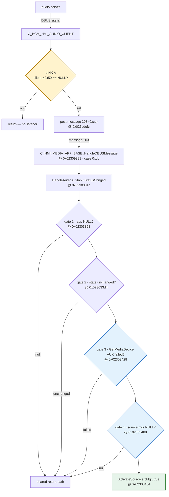

# The AUX auto-switch, gate by gate

This is the single reference for what has to happen, in order, for the unit to select AUX
by itself when a signal appears — and what is known about each step. Everything with an
address was read out of the `NAV` image; everything marked **executed** was run under
[the emulator](EMULATION.md) rather than reasoned about.

If you only read one thing: the patch set does not fail at the step the project spent two
years assuming it did, and the one link that has never been checked is the first one.

## The chain



Reading the colours: **LINK A** (amber) is the only link that has never been observed — it
depends on runtime state. **Gates 3 and 4** (blue) never fire, proven under
[the emulator](EMULATION.md). The success path (green) is reached once the four gates pass.
The same trace as a call listing:

```
audio server
  --DBUS signal-->  C_BCM_HMI_AUDIO_CLIENT
                      if (client->0x50 == NULL) return;        <-- LINK A: no listener
                    post internal message 203 (0xcb)           @ 0x025cdefc
  --message 203-->  C_HMI_MEDIA_APP_BASE::HandleDBUSMessage    @ 0x02309398
                      case 0xcb                                @ 0x02309638 -> 0x02309fbc
  --direct call-->  HandleAudioAuxInputStatusChnged            @ 0x0230331c
                      gate 1  app = this->0x50df4, NULL?       @ 0x02303358
                      gate 2  state unchanged?                 @ 0x023033d4
                      gate 3  GetMediaDevice(AUX) failed?      @ 0x02303428
                      gate 4  source manager NULL?             @ 0x02303468
                    ActivateSource(srcMgr, true)               @ 0x02303484
```

## Link A — the listener

The client only posts message 203 if something registered for it:

```c
void OnAuxSignalStatusChanged(client) {     // 0x025c9e78
    if (client->0x50 == NULL) return;       // 0x025c9e9c
    Post203(client->0x50);                  // 0x025cdefc
}
```

`client->0x50` is written by one setter (`0x025c97f0`), called from two places, both of
which look like this:

```c
if (app->0xc == NULL) return;           // no proxy, no registration
SetListener(app->0xc, app);
```

So the listener exists only if `app->0xc` does. **That same `app->0xc` is what the AUX
status query dereferences** (`0x025cb280`), returning `-1` without touching its out-param
when it is null — and gate 2 discards that return value. One null pointer there would
produce exactly the symptom seen on the car: no switch, no error, nothing in the UI.

`app` itself is `mediaApp->0x50df4`, assigned at `0x022bc4e8` from a DBUS client factory
(`0x025fc3e8`) called as `Create(3, 0xc8, this)`. That factory is a lookup-or-create with
**several paths that return NULL** — it needs a DBUS connection at the moment the media
application initialises. Whether any of them is taken on a real unit is not knowable from
the image; it is the open question.

!!! question "This link has never been observed"

    Everything downstream of it has now been executed. Link A has not, because it depends
    on runtime state (a DBUS connection) that no static reading can settle.

## The four gates in the handler

Recovered by executing the function, not by reading it:

```c
void HandleAudioAuxInputStatusChnged(this) {       // 0x0230331c
    app = this->0x50df4;                           // 0x022ad2c0 — a plain getter
    if (app == NULL) return;                       // gate 1  @ 0x02303358
    ctor(&obj);                                    // 0x02368080 — zeroes obj entirely
    GetAuxStatus(app, &signal);                    // 0x025cb258 — RETURN VALUE DISCARDED
    state = (signal != 0);
    if (state == this->0x51449) return;            // gate 2  @ 0x023033d4
    this->0x51449 = state;
    if (GetMediaDevice(mgr, AUX, &obj)) return;    // gate 3  @ 0x02303428
    SetMediaDeviceState(mgr, AUX, 2);              // 0x022f388c
    if (obj[0x10] == NULL) return;                 // gate 4  @ 0x02303468
    ActivateSource(obj[0x10], true);               // 0x0273a248
}
```

| gate | tests | status |
|---|---|---|
| 1 | the audio client exists | **unknown** — the only untested link, see above |
| 2 | the AUX state actually changed | **a real gate** — only acts on a transition |
| 3 | `GetMediaDevice(AUX)` succeeded | **never fires** — executed; see below |
| 4 | the device carries a source manager | **never fires once gate 3 passes** |

**Gate 2 is a change detector.** A signal already present when the state is first recorded
produces no activation, because nothing changed. Worse, because the status query's return
value is thrown away, a *failed* query reads as "no signal" and lands here as "no change".
A broken link A and a genuinely silent AUX input are indistinguishable at this point.

**Gate 3 is what `aux-autoswitch` nops, and it never fires.** The AUX media device is
registered unconditionally at start-up, so `GetMediaDevice(AUX)` succeeds. **Executed:**
running the registration function fills the table with types `{0, 1, 2, 3, 5}`.

**Gate 4 is why nopping gate 3 would not have helped anyway.** `GetMediaDevice` writes
nothing to its out-param when it fails, so the field gate 4 tests is still the zero the
constructor left. See [Emulating the firmware](EMULATION.md) for the full truth table.

!!! danger "Do not nop gate 4"

    `0x0230346c` loads that field straight into `r3` as `ActivateSource`'s `this`. Removing
    the guard calls a C++ method on a null pointer, on the HMI thread.

## The media device table

`GetMediaDevice` and its neighbours operate on a fixed array hanging off the media app at
`this+0x50e60`:

```
mgr + 0x00 + n*0x20   device record n, 6 slots
mgr + 0xc0            how many are in use
```

Each 32-byte record holds its type at `+0x00` and its source manager at `+0x10`. Three
functions matter:

| function | address | behaviour |
|---|---|---|
| `FindDevice(mgr, type)` | `0x022f3608` | linear scan of the first `mgr[0xc0]` slots; returns the record or NULL |
| `GetMediaDevice(mgr, type, out)` | `0x022f3750` | `FindDevice`, then field-by-field copy into `out`; returns 0, or **-1 writing nothing** |
| `AddDevice(mgr, src)` | `0x022f3ad0` | append; refuses when `mgr[0xc0] > 5` |

Registration runs once, from media-app init (`0x022bf934` → `0x022b833c`), and is
unconditional — every early-out branch in the caller rejoins before the call. It registers
types 0, 1, 2, 3 and 5 outright, then type 4 only if the byte at `this+0x51450` is set.

### Which type is AUX

Type **5**. Two independent lines of evidence:

- Every `GetMediaDevice`/`SetMediaDeviceState` call site that passes type 5 — `0x02303404`,
  `0x02303450`, `0x02303564` — is **inside the AUX handler**, and no other function uses it.
- Type 4, the only other candidate, is used by unrelated call sites and is gated on a byte
  written in exactly **two places in the whole image, both constructors, both storing 0**.
  Nothing sets it, so type 4 can never be registered at all.

Note the trap: this is not the same enum as the **source** list recovered from the HMI
`OnEventSelect*` handlers. Two namespaces, overlapping numbers. Do not carry a value from
one into the other — and there are more than two.

### Six source numberings, and which one `Last_Source` uses

| numbering | where it comes from | AUX is |
|---|---|---|
| media device type | the table `GetMediaDevice` searches | **5** |
| HMI source | `OnEventSelect*` → `CreateNotificationCommand` | **7** |
| audio module `SRC_*` | the name table at `0x02f9d60c`, printed as `Current_source` | **5** |
| `C_MGR_SRC` scheduler position (`POS_*`) | `AllocateSource`'s `Sched_Pos` field and the SPY dump's switch | **7** |
| `C_MGR_SRC` request `SrcId` | `AllocateSource`'s `SrcId` field | **unknown for AUX**; observed values are `0xba00`, `0xbc00`, `0xc000`, `0xe200`, `0x17400`, `0x1e200`, `0x1e600` |
| screen position | `GetSourceAtPosition`, 0-based | **4** |

The audio module's table is contiguous from `SRC_NO_SOURCE = 0`:

```
0 SRC_NO_SOURCE   1 SRC_TUNER   2 SRC_CD    3 SRC_MP3      4 SRC_CDC
5 SRC_AUX         6 SRC_PHONE   7 SRC_TTS   8 SRC_TA_PTY   9 SRC_TTS_ON_AUX
10 SRC_AUX_CONVERGENCE  11 SRC_BLUETOOTH  12 SRC_MTB  13 SRC_MLDIPO_RECO_PHONE
```

Two of these put AUX at `7`, but the SPY capture now settles which `C_MGR_SRC` field the
factory `Last_Source = 1` follows. At boot the same module logged:

```
6639::Last_Source : 1 (0x1)
9742::AllocateSource : MsgSrc=10, SrcId=0xbc00, Sched_Pos=1, ...
Current_source ... SRC_TUNER
```

That is **executed runtime evidence**: tuner was active; its request's `SrcId` was `0xbc00`; its
scheduler position was `1`; and `Last_Source` was `1`. Therefore `Last_Source` follows the
`Sched_Pos`/`POS_*` namespace, **not the raw request `SrcId`**. For AUX that namespace says `7`.
This is stronger than the previous inference from object ownership and corrects the section below,
which had labelled request `+0x18` as the value compared directly with `Last_Source`.

`4` and `7` have both been shipped in payloads without the unit starting on AUX, but neither value
reached the live database. The later SPY settings dump still reads
`supervisor.Last_Source.0 <int> : 1`, and the updater log still copied the payload into uppercase
`SQLITE`. So `7` remains untested as a live setting; the observed boot-to-radio result still
settles delivery, not the value.

### The key belongs to `C_MGR_SRC`, and the value must match a live source request

The key is read and written through the generic config loader in the core middleware — read
at `0x01699390`, written at `0x01695e2c` from the field at `+0xb4` of the object. That object
is `C_MGR_SRC`: its `UP_Keys` names (`Last_Source`, `Last_Source_Priority`,
`Src_Radio_SchedPos`, `Src_Media_SchedPos`, `Src_Radio_Priority`, `Src_Media_Priority`) sit
contiguously at `0x0300a578`, immediately ahead of the class's own log strings at
`0x0300a6a4`.

Following `+0xb4` gives the shape of the value. In the NAV build:

| address | what it does |
|---|---|
| `0x01699490` | boot restore: the value read back from `Last_Source` is **stored straight to `+0xb4`** and mirrored to the global `0x035e4cd0`, with no validation at all |
| `0x016995b4` | constructor: `+0xb4` and `0x035e4cd0` are both initialised to `1` — the same value the factory database ships |
| `0x0169c6ac` | reads `0x035e4cd0` and passes it as the scheduler-position argument to `0x016977d0` |
| `0x016977d0` | the position setter — walks the request lists and writes `+0xb4` only on a matching `Sched_Pos`; a miss leaves `+0xb4` alone |
| `0x016957ec` | the scheduler — **selects the source to restore** by matching `node+0x18` (`Sched_Pos`) against `+0xb4` |
| `0x0169815c` | `C_MGR_SRC::AddRequest` — copies `SrcId` to `node+0x04` and `Sched_Pos` to `node+0x18` |
| `0x0169c51c` | the `C_MGR_SRC` message dispatcher (message id `0x62d5`): case 0 → `AddRequest`, case 1 → `RemoveRequest` at `0x01697d60`, case 2 → re-apply `Last_Source` |
| `0x0169bf74` | `C_MGR_SRC::AllocateSource` — the client entry that packages a request and sends it into the dispatcher |
| `0x0169a2e4` | the `MGR_SRC SPY` dump — switches on `Sched_Pos` to name each position (`POS_*`) |

`0x016977d0` walks the first request list, anchored at `this+0xd4` (`next` at `+0x3c`),
comparing its scheduler-position argument against each node's `+0x18` (`Sched_Pos`) field, and
writes `+0xb4` on a match. A position that matches nothing falls straight out to the return path
**without touching `+0xb4`**:

```
016977dc  lwz    r9, 0xd4(r3)     ; head of the first request list
016977e0  cmpwi  cr7, r9, 0
016977e4  bne    cr7, 0x16977f8
016977e8  b      0x1697854        ; empty list -> give up
016977ec  lwz    r9, 0x3c(r9)     ; node = node->next
016977f0  cmpwi  cr7, r9, 0
016977f4  beq    cr7, 0x1697854   ; ran off the end -> give up
016977f8  lwz    r0, 0x18(r9)     ; node->Sched_Pos
016977fc  cmpw   cr7, r4, r0
01697800  bne    cr7, 0x16977ec   ; no match -> keep walking
01697804  ...                     ; matched: commit to +0xb4
```

!!! warning "The setter cannot reject the flashed value"

    Because the miss path leaves `+0xb4` untouched, the setter is not a validator for what the
    database ships. Boot restore has already written `+0xb4` unconditionally, and the
    message-2 path only re-affirms it from `0x035e4cd0`. **A value written into the database
    always takes effect as far as `+0xb4` is concerned** — the question is only whether
    anything downstream does anything with it.

The consumer that gives the value its meaning is the scheduler at `0x016957ec`. It walks the
same lists and, in the mode where the stored source is being restored, picks the node whose
`+0x18` equals `+0xb4`:

```c
iVar7 = DAT_035e4cd0;                                       // the mirrored Last_Source
...
do {
    if (*(int *)(iVar6 + 0x18) == *(int *)(param_1 + 0xb4)) {   // node Sched_Pos == Last_Source
        ... remember this node as the source to restore ...
    }
    iVar6 = *(int *)(iVar6 + 0x3c);
} while (iVar6 != 0);
```

So `Last_Source` must equal the **`Sched_Pos` the source request registered**, or nothing matches
and no source is restored — the unit falls back to its default. The runtime tuner tuple
`Last_Source=1, SrcId=0xbc00, Sched_Pos=1` confirms this interpretation. That is the real gate,
and it is downstream of the value, not a check on it.

#### What a request node is, and who writes `+0x18`

`C_MGR_SRC::AddRequest` (`0x0169815c`) is the registration site this page previously listed as
unfound. It logs under the `C_MGR_SRC` / `AddRequest` strings (`0x0300a6a4` / `0x0300a6b0`)
and is reached from the class's message dispatcher, keyed on **message id `0x62d5`**:

```
source module
  -> send(object, 0x62d5, opcode, flags)      common helper 0x014da78c
  -> C_MGR_SRC dispatch  FUN_0169c51c         (0x62d5 matched at 0x1698e18)
       case 0 -> FUN_0169815c  AddRequest
       case 1 -> FUN_01697d60  RemoveRequest
       case 2 -> FUN_016977d0(this, DAT_035e4cd0, 0, 0)
```

The message body is a 0x6a-byte payload; the request is the 0x2c-byte struct at `+0xc` of it
(`FUN_0169c71c` is a plain `memcpy`). `AddRequest` copies that struct into a freshly allocated
node, links it, and commits:

```c
node = SUB_01695590(this, idx * 4 + this + 0xc4);
if (*(int *)(idx * 4 + this + 0xd4) == 0) *(int *)(idx * 4 + this + 0xd4) = node;
*(short *)(node + 0x00) = req.MsgSrc;
*(int *)  (node + 0x04) = req.SrcId;
*(int *)  (node + 0x14) = req.Type;
*(int *)  (node + 0x18) = req.Sched_Pos;  // <-- the field the setter and scheduler compare
...
FUN_016977d0(this, req.Sched_Pos, 1, 1);
```

??? note "Corrections to an earlier reading of this page"

    * `this+0xd4` is **not a single list of registered sources**. It is the first of four list
      heads in an array (`+0xd4`, `+0xd8`, `+0xdc`, `+0xe0`) selected by a mapping of the request
      `Type`. The nodes are **pending requests**, not a registry.
    * The setter's "must match a node" condition is satisfied trivially here: `AddRequest` inserts
      the node and then immediately calls the setter with the same id. It was never the gate it
      looked like.

The request carries both values: `SrcId` at request `+0x04` (byte `0x10` of the message payload)
and `Sched_Pos` at request `+0x18` (byte `0x24` of the payload). The live dump prints both, which
is what exposed the earlier conflation. AUX's `Sched_Pos` is known (`7`); AUX's raw `SrcId` remains
unknown and is not what `Last_Source` stores.

Requests reach the dispatcher through the client entry `C_MGR_SRC::AllocateSource`
(`0x0169bf74`), which copies the 0x2c-byte request and sends it. `AllocateSource` is reached
from the client wrapper `0x016bc1dc` — not `0x016bc1f0`, which an earlier pass took for the
function start and which is really four instructions inside it — and that wrapper resolves the
service directly with `FUN_0103155c(0x62d4, 0)`.

The ~30 `0x62d5` sites are not that table. Eighteen of them sit at
`0x014dc1a8`–`0x014dd358`, but their common helper `0x014da78c` emits a **0x14-byte** control
body, not the 0x6a-byte request, so they are short notifications that reuse the same message
id rather than source registration.

The client API is a fixed cluster, and it is worth knowing its shape before hunting in it. Eight
wrappers sit at `0x016bbec4`–`0x016bc2ac`, each with exactly one caller; those callers are the
public API at `0x016c09bc`–`0x016c0d3c`; and the public entries are exported through a **service
API table** at `0x0307aedc`–`0x0307af00` (C_MGR_SRC's slots — the table itself runs well beyond
them). Nothing references that table by literal address or by `lis/addi`, because it is reached
through the dynamic service registry (`FUN_0103155c(0x62d4, …)`, `FUN_01001178()`).

That is the wall for static tracing, and it is worth stating plainly: **the per-source callers of
`AllocateSource` cannot be found by xref.** `AllocateSource` has one caller, that caller has
none, and the entry above it is indexed at run time. Finding which module allocates AUX's
request needs the registry resolved, not another xref sweep.

!!! warning "Provenance"

    Everything in this subsection is **read from decompiled code**, not executed — the
    corrected mechanism included. The project's rule applies: reachability is proof, and a
    reading is not. The part corroborated by execution is the setter's own shape, which was
    confirmed by disassembly when this page was first written.

The `Sched_Pos` space is `C_MGR_SRC`'s own **position** enum, readable from the SPY dump at
`0x0169a2e4`, which switches on a per-source field at `+0x370` and names it:

| value | name | value | name |
|---|---|---|---|
| `0` | `POS_NULL` | `6` | `POS_VIDEO` |
| `1` | `POS_TUNER` | `7` | `POS_AUX` |
| `2` | `POS_1CD` | `8` | `POS_BT` |
| `3` | `POS_MP3` | `9` | `POS_USB` |
| `4` | `POS_CDC` | `10` | `POS_IPOD` |
| `5` | `POS_JBX` | `0xff` | `POS_NOT_SCHEDULED` |
|  |  | other | `POS_MGR_SCR_NOT_SCHEDULED` |

**AUX is `7` here, and `5` is the Jukebox** — so the value
[`aux-default-retry.json`](https://github.com/KRoperUK/smeg-plus-patches/blob/main/builds/aux-default-retry.json)
ships has `C_MGR_SRC`'s own naming behind it, not only the HMI numbering's.

Two enums describe sources and they agree at `1` — the factory `Last_Source`, `POS_TUNER`, and
the audio module's `SRC_TUNER` all coincide — but they disagree at AUX: the audio module's
`SRC_*` table has `SRC_AUX = 5`. Since `+0xb4` belongs to `C_MGR_SRC`, its own enum is the one
that should apply, which is a second independent line of evidence for `7` beside the HMI
numbering.

??? note "Why the enum is read from the switch, not the literal order"

    Read the mapping from the switch, not from the string literals. `POS_AUX` sits between
    `POS_MP3` and `POS_BT` in the literal table but is `7` in the enum; an earlier version of
    this page assumed the literals were in value order and concluded `5`. They are not in value
    order.

### The beacon, and what the retry actually answered

Because no `USER_DATA` flash has yet been confirmed to apply, a unit that still starts on
radio is ambiguous — wrong value, or payload skipped again? Ship a **beacon** alongside the
change: a second, unrelated key whose effect is visible and trivially reversible.
`aux-default-retry.json` moves `clock.Time_Zone` from `16` to `0`. After the flash, read the
configured time zone in the settings menu — not the clock face, which a GPS-slaved clock
corrects regardless:

| time zone | source | conclusion |
|---|---|---|
| changed | AUX | the value is right and the mechanism works |
| changed | radio | payload applied and `+0xb4` holds `7`, which the enum says is AUX — so suspect the path (registration or scheduling), not the number |
| unchanged | either | payload was skipped again; the source result means nothing |

The retry answered **`unchanged`**: the time zone did not move, so the payload was skipped once
more and the boot-to-radio result is uninformative. What that points at — a hard-coded source
path that was nonetheless correct on the stick, a step-gated copy, and a save/restore round trip
— is written up under the second flash in [Hardware verification](VERIFICATION.md).

## What to do next

Three things are open, in order of value.

**Observe it instead — the spy path is not blocked.** This is the cheapest route to the same
answer. `C_MGR_SRC`'s per-source dump (`0x0169a2e4`) emits through `C_BCM_SPY::WriteData`, not
through `Log_msg`'s stubbed sink, so a boot-time dump would list the registered sources and their
`POS_*` ids without the log sink being fixed first. See
[Cheatcodes](CHEATCODES.md#a-module-dump-reaches-the-spy-not-the-dead-log-sink) and issue **#24**.

**Capture AUX's request at runtime.** The SPY dump already proved `Last_Source` follows
`Sched_Pos`, not `SrcId`, and the enum says `POS_AUX = 7`. What this capture did not contain is an
AUX `AllocateSource` line: AUX was available, but the current source stayed tuner. Selecting AUX
before running `SPYSTORE` should yield the missing tuple (`MsgSrc`, raw `SrcId`, `Sched_Pos=7`)
without resolving the dynamic service table. That would execute the AUX side of the mapping as
well as the tuner side.

**Give the firmware a log to write to.** The handler logs its own name at level 1 on its
**shared return path** — and **executed**: every one of the four exit paths, plus the success
path, reaches that log call. So the line `HandleAudioAuxInputStatusChnged() -` appearing at
all means the message arrived and the handler ran; its absence means link A is broken.

That would be one flash — except that this build has **no log output path**. `Log_msg`'s
sink is stubbed, so forcing the trace mask formats the message and then discards it, and
flashing both diagnostic patches makes the logger and the sink call each other. See
[Patch reference](PATCHES.md).

The sink now has a candidate destination: VxWorks `logMsg` at `0x00484a94`, recovered from
the symbol table inside the BSP image, with `patches/diagnostic-logsink.json` to point it
there. What is still unknown is where `logMsg`'s output physically surfaces on this unit,
which is issue #94. Until that is settled the diagnostic build is buildable but not
readable.

## What the first car test established

The build described above was flashed and observed. Three results, one of them a
falsification.

**`aux-boot-default` is applied, correctly located, and ineffective.** The shipped image holds
`39200007` at `0x0169948c` (pristine holds `81210008`), and that site falls inside
`C_MGR_SRC::StartUp` (`0x016990b8`, 1004 bytes, ending exactly where `C_MGR_SRC::Init` begins at
`0x016994a4`). So the patch does what its description says — `li r9,7` then `stw r9,0xb4(r31)`,
with the value read straight back at `0x01699498` — and the unit still comes up on **FM**, *with
audio playing into the AUX input*. AUX was visible and selectable, so `aux-autoswitch` worked.

That falsifies the obvious explanation. The reading this file previously leaned on — no signal,
so no request node, so FM — does not survive a test with signal present: a node for
`Sched_Pos = 7` is there and does not win.

**Where the match actually happens.** A full scan for readers of `+0xb4` finds `0x01695b90`,
inside `ExecuteAllocationFirstRound` (`0x016957ec`–`0x01695bfc`), near the end of it. It is the
only reader of that field in that function.

**A hypothesis, explicitly not a finding: ordering.** `ExecuteAllocationFirstRound` is at
`0x016957ec` and `StartUp` at `0x016990b8`. If the first allocation pass runs *before* `StartUp`
writes `+0xb4`, then the match ran against the old value — `Last_Source` = 1, FM — and picked FM
correctly; after which `StartUp` writes 7 into a field nothing reads again until the next boot,
by which time FM has overwritten it. That accounts for "always FM, whatever is on the input".

**The ordering is not verified.** Address order is not execution order, and this file already
records one conclusion that executing overturned.

**The candidate fix, if the ordering holds:** patch the read at `0x01695b90` to a constant 7
rather than the write at `0x0169948c` — the same one-instruction trick, applied downstream of the
ambiguity so it holds whichever order the two functions run in. Deliberately not written as a
patch entry yet.

## A symbol map now exists

The SPYSTORE dump from the same unit carries `abs_symbols_base.txt.gz` and four companions —
**98,365 symbols**. This is the first symbol map this repository has had, and it changes what is
checkable rather than merely making it convenient:

  * `tools/callers.py` works: a scan finds 108,907 `bl` sites and 12,982 in-image targets. Its
    documented limit stands — direct branches only — and `C_MGR_SRC::StartUp` genuinely has **0
    direct callers** because it is virtual. The vtable holds exactly one pointer to it, at
    `0x0307aa74`.
  * `ppcdis`, `xref`, `callers` and `symdiff` can now be run against real firmware, which is
    what issue **#38** says has never happened.

A warning for whoever picks this up: the entry point `InitializeMetaNav` at `0x01000000` also has
0 direct callers, and that is correct — the boot loader jumps to it, nothing in the image branches
to it. Using it as a control for "is the tool working" produces a false negative, as it briefly
did while writing this.

## Two display findings

**The version shown on the unit is not `GUI_VER`.** `GUI_VER` was set to `32.01` for this build,
and it appears nowhere on the unit. The "Display version" screen reads `cd 26482`, which is
`Data_base/media.inf` verbatim — a file this build did not touch. The claim in `AGENTS.md` that
`GUI_VER` is "the only safe visible field" is therefore wrong or at least misleading; do not use
it as an "did it apply" beacon.

**A renamed ringtone keeps its old name.** The custom tone played (so the media partition
applied), but the list still said `Alien`. The names are rows in
`Data_base/sqlite/up_common.sqlite` (`UP_Keys`, section `phone`, key `Ringing_List`) — a settings
database, not a media file. A normal package update writes the package's copy, not the unit's
live one, which is also why paired phones survive. **Inference, not verified**: it has not been
confirmed that the unit reads the name from its own copy rather than from the package.

## Status of each claim

| claim | how it is known |
|---|---|
| the chain's addresses and dispatch | read from the image |
| gates 1–4 and their order | **executed** |
| gate 3 never fires; the registered types | **executed** |
| gate 4 blocks a nopped gate 3 | **executed** |
| every exit path logs | **executed** |
| `Log_msg` is gated by a BSS mask | **executed** |
| type 5 is AUX | inferred from call sites, strongly |
| `aux-sticky`'s second edit does what it says | **executed on all three builds** — after being corrected; it shipped unconditional |
| link A's state on a real unit | **not known** — needs the car |
| `AddRequest` writes `SrcId` to `node+0x04` and `Sched_Pos` to `node+0x18`; the lists at `+0xd4` are requests, not a registry | **read from disassembly/decompiled code** — field names corroborated by the named `SetScheduledInit` call |
| the scheduler matches `node+0x18` (`Sched_Pos`) against `+0xb4` | read statically; **runtime tuner tuple corroborates it** |
| boot restore writes `+0xb4` with no validation | **read from decompiled code** — not executed |
| `POS_AUX = 7`, `POS_JBX = 5`, `POS_TUNER = 1` | read from the SPY switch; **`POS_TUNER=1` executed in the captured `AllocateSource` tuple** |
| `AllocateSource` is the client entry that feeds `AddRequest` | read statically; the function's own runtime lines were captured |
| `Last_Source` uses `Sched_Pos`, not raw `SrcId` | **executed** — tuner had `Last_Source=1`, `SrcId=0xbc00`, `Sched_Pos=1` |
| `7` is the value AUX needs | strongly supported: enum says `POS_AUX=7`; AUX tuple and live setting still not executed |
| `aux-boot-default` applies and is correctly located in `C_MGR_SRC::StartUp` | **executed** — `39200007` verified in the shipped image at `0x0169948c` |
| `aux-boot-default` changes the boot source | **falsified on hardware** — still FM, with audio playing into AUX |
| `ExecuteAllocationFirstRound` reads `+0xb4` at `0x01695b90` | **read from disassembly**, whole-image scan for readers of that field |
| `StartUp` runs before the first allocation pass | **not known** — ordering assumed from address order, which is not evidence |
| the vtable for `C_MGR_SRC` holds exactly one pointer to `StartUp`, at `0x0307aa74` | **read from the image** |
| `callers.py` finds direct `bl` callers | **executed** — 108,907 sites, 12,982 targets; virtual methods return 0 by design |
| the Display-version screen reads `media.inf`, so `GUI_VER` is not a visible beacon | **executed on hardware** — `cd 26482` is `media.inf` verbatim |
| a renamed ringtone keeps its old name after a package update | **executed on hardware**; the settings-database reason is **inferred** |
