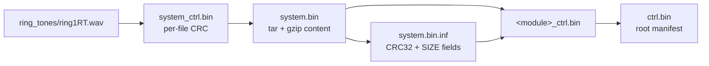

# Media partition (`system.bin`)

The head unit keeps its user-facing data partition in `AUDIO_BT/system.bin` /
`NAV/system.bin`: a gzip-compressed **tar** that is extracted to `/SYSTEM/` on the unit.

The partition can be **rebuilt**, and `tools/patch_media.py` does it: extract the tar,
replace a file, re-tar, re-gzip, then repair `system_ctrl.bin` (per-file CRCs),
`system.bin.inf` (`CRC32` + the `SIZE` fields), the module manifest and the root manifest.
Replacing a ring tone is the worked example — see [Ring tones](RINGTONES.md). The tools
support **replacement only**. Adding a file needs a new `system_ctrl.bin` record; that
record format is now fully mapped (see below), so it is mechanically expressible, but
whether the updater accepts a record count it has never seen is untested — which is why the
tools still refuse.

## How the partition is described

| file | role |
|---|---|
| `<module>/system.bin` | the gzipped tar (media partition payload) |
| `<module>/system.bin.inf` | `CRC32:` plus `SIZE:` / `SIZE_1..SIZE_32` |
| `<module>/system_ctrl.bin` | per-file CRC32 list for everything inside the tar |
| `<module>/system_data.bin` (+ `.inf`) | separate small data payload |
| `<module>_ctrl.bin` | module manifest: CRC32 for `system.bin`, its `.inf`, `system_ctrl.bin`, … |
| `ctrl.bin` (root) | CRC32 for each `<module>_ctrl.bin` |

So a single file inside the partition sits under a long cascade:



### The `SIZE` fields — solved

`SIZE:` and `SIZE_1..SIZE_32` are the uncompressed *contents* size, not the tar or the
gzip size, and they are computable:

* **`SIZE`** = the sum of the file sizes inside the tar, excluding tar headers and
  padding. Verified exactly against the real partition: 844 files, sum **32 710 671**,
  matching `SIZE:` to the byte.
* **`SIZE_n`** = the same sum with every file rounded up to an *n* KiB block
  (`Σ roundup(size, n * 1024)`). Exact for n = 8, 16 and 32. For n = 1, 2 and 4 it lands a
  fixed amount *below* the vendor's values — **29 696**, **18 432** and **8 192** bytes
  respectively, the same three constants on both a stock and a rebuilt partition. That
  rule was not identified, so the values are not derived from scratch.

They are read by **`UpgPlugin.out`**, not `upgrade.out` — the plugin's
`C_UPG_PLUGIN_Interface::GetSize()` / `GetPartitionBlockSize()` select the field that
matches the destination's block size, falling back to plain `SIZE` when the block size
is not one of the managed values (`SD Block size (%d) not managed!`). They feed the
media space-check (`C_APPLI_UPG_PLUGIN::CheckMediaTask`), so they should be recomputed
after a media edit — but nothing needs to be obtained from elsewhere to do it.

**How the patcher handles them.** Our own formula reproduces `SIZE` exactly but lands a
fixed, module-independent amount below the vendor's values for n = 1/2/4 (29 696, 18 432
and 8 192 bytes — a rule we could not identify). Rather than guess it,
`tools/patch_media.py` applies the *delta* to the values already in the `.inf`: an
untouched partition keeps its numbers byte-for-byte, and a changed file moves each field
by exactly its own size change.

**What this means:** the media partition can be rebuilt. `tools/patch_media.py` extracts
the tar, swaps a file, re-tars and re-gzips, then updates `system_ctrl.bin` (the per-file
CRCs), `system.bin.inf` (`CRC32` + the `SIZE` fields), the module manifest and the root
manifest. See [Running the tools](RUNNING.md).

### `system_ctrl.bin` — fully mapped

```
0x00   header, 48 bytes
0x30   records, 264 bytes each, x <count>
end    CRC32 of everything before it (4 bytes, big-endian)
```

The header:

| offset | field |
|---|---|
| `0x00` | date string — `19/09/2017` in the shipped packages |
| `0x0C` | version string — `2.1.0.0` |
| `0x2C` | **record count**, `u32` big-endian |

Each record is **264 bytes**:

```
[path][zero padding][CheckType @ +259 (1 byte)][CRC32 @ +260 (u32, big-endian)]
```

- **path** is absolute and NUL-terminated: `/SYSTEM/<partition-relative path>`. The longest
  in the shipped NAV partition is 89 bytes, well inside the 259 available.
- **CheckType** is `2` in 815 of the 845 records and `3` in the remaining 30.
- **CRC32** for a type-2 record is the CRC32 of that file's **contents**.

**Verified end to end** against `NAV/system_ctrl.bin`:

- the count at `0x2C` is **845**, exactly the number of files in the tar;
- all 845 record paths resolve to a tar member, and **no** tar file lacks a record;
- every type-2 record's CRC equals `crc32(tar member contents)` — 815/815;
- the trailing `u32` equals `crc32` of all preceding bytes (`0xd05fd5e8` for the shipped file).

**Open — the 30 `CheckType = 3` records.** Their field at `+260` is **not** a content CRC: it
matches neither the raw contents nor a gunzipped copy. They are the four
`Data_base/TMP/lib/license/*` documents plus `Application/CCOD/libcheatcode_AFTT.out`.
Tested and rejected against one of them (`LGPL_EXCEPTION.txt`, field `0xffff80f9`): CRC32 of
the raw member bytes as stored in the tar, of the tar header, and of the path, plus
adler32. Several of the values are small or negative when read signed, which suggests a
different meaning rather than a checksum — treat type 3 as "field meaning unknown".

**What this unlocks.** Adding a file to the partition is now mechanically expressible:
append a 264-byte type-2 record, increment the count, recompute the trailing CRC32, add the
file to the tar, move the `SIZE` fields by its size, and rebuild the module and root
manifests. What is **not** established is whether the updater *accepts* a count it has not
seen before — it has only ever been handed a packager's own 845. That needs a hardware test,
so the tools still refuse to add files.

## Top-level layout

```
Data_base/          sqlite databases, boardfs GUI resources, graphics/radio logos, fonts
Application/        PKG/ (symbol maps), CCOD/ (cheatcode libraries), BlackFin/
ring_tones/         phone call / status tones  (see below)
wait_tones/         network call-hold tones, one per language
AVR_img/            front-panel AVR images
internet_default/   browser portal defaults
```

## Ring tones — `/SYSTEM/ring_tones/`

All are **RIFF/WAVE, Microsoft PCM, 16-bit, mono, 44 100 Hz**. The five `ringN` files are
the selectable ringtones; the rest are call/status tones.

| file | duration | size |
|---|---|---|
| `ring1RT.wav` | 1.78 s | 157 018 |
| `ring2RT.wav` | 3.58 s | 315 816 |
| `ring3RT.wav` | 3.58 s | 316 264 |
| `ring4RT.wav` | 1.78 s | 156 830 |
| `ring5RT.wav` | 3.56 s | 313 838 |
| `busyRT.wav` | 4.49 s | 396 206 |
| `errorRT.wav` | 0.22 s | 19 900 |
| `koRT.wav` | 0.22 s | 19 900 |
| `okRT.wav` | 0.22 s | 19 724 |

The `RT` suffix is part of the real filename — the application image contains the
literal strings `ring1RT.wav` … `ring5RT.wav` as well as `/busy.wav`, `/error.wav`,
`/ok.wav` and `/ring1.wav` … `/ring5.wav`, so more than one form exists in the code.

Relevant code: `C_SRV_RING_TOUCH` (`srvPlayTouch`, `srvSetCurrentIDTone`,
`SetRingFilePath`), `C_FS_STORAGE_CTRL_PATH::GetRingTonesDir`, and
`GetRingToneList` / `GetRingtoneID` / `SetRingToneID` behind the phone settings UI.

**Custom ringtones** means replacing `ringNRT.wav` with your own file in the same format,
keeping the filename. This works: the partition rebuild is implemented, and the `SIZE`
fields are carried forward by exactly the size change of the replaced file. Replacements
are essentially never the same size as the original, so the tar and every manifest above
it do change — which the tool handles in one step. See
[Ring tones](RINGTONES.md) for the worked example, including the level-matching caveat:
the stock tones are mastered loud (peak ≈ −1 dBFS), so an unmodified music track will
sound noticeably quieter than the tone it replaced.

## Wait tones — `/SYSTEM/wait_tones/`

Network call-hold tones, one per language: **RIFF/WAVE, PCM, 16-bit, stereo, 8 000 Hz**.

```
MM_HoldOn_CRC_8kHz.wav  14.60 s      MM_HoldOn_ITI_8kHz.wav  21.82 s
MM_HoldOn_CZC_8kHz.wav  12.85 s      MM_HoldOn_PLP_8kHz.wav  18.43 s
MM_HoldOn_DUN_8kHz.wav  20.25 s      MM_HoldOn_PTP_8kHz.wav  19.40 s
MM_HoldOn_ENG_8kHz.wav  17.31 s      MM_HoldOn_RUR_8kHz.wav  19.49 s
MM_HoldOn_FRF_8kHz.wav  20.49 s      MM_HoldOn_SPE_8kHz.wav  19.31 s
MM_HoldOn_GED_8kHz.wav  22.15 s      MM_HoldOn_TRT_8kHz.wav  14.09 s
MM_HoldOn_HRH_8kHz.wav  18.46 s
```

Path helper: `C_FS_STORAGE_CTRL_PATH::GetWaitTonesDir`. The suffixes are PSA language
codes (`CRC` Czech, `ENG` English, `FRF` French, `GED` German, `ITI` Italian, … ).

## Application/ (inside the partition)

```
Application/PKG/        symbol maps: abs_symbols.txt.gz, abs_symbols_base.txt.gz,
                        abs_symbols_light.txt.gz, symbols_bsp.txt.gz
Application/CCOD/       cheatcode libraries: libcheatcode_<NAME>.out (+ .inf, .txt.gz)
Application/BlackFin/   DAB_SW_MAXIM_PRS1.dat - DAB chipset firmware blob
```

The application image itself is **not** here — it is `AppBin/f_BigQuick.bin`.
The cheatcode libraries are documented in [Cheatcodes](CHEATCODES.md).

!!! warning "This is NOT the boot splash"

    An earlier version of this page claimed `peugeot.pkg` holds the boot splash. **That is
    wrong, and flashing a replaced one proves it** — the unit still shows the factory
    Peugeot animation. Two things say why:

    - the application image contains **no reference at all** to `peugeot.pkg`,
      `graphics/logo` or the `_adml_` names, so nothing reads these files at boot;
    - the boot artwork lives in a separate **NAND "Logo Area"**, with its own header,
      CRC check and animation frames — the updater has `WriteNANDLogo`, `ReadNand_Logo`,
      `VerifyNANDLogo`, `LogoAndAlertsHeaderShow` and a `(CheckCRCLogoAndAlertsFile) CRC
      picture[%d]` check, all behind `TakeMutexNANDAccess`.

    **And there is no logo step in the USB update flow.** `nm upgrade.out` shows the
    sequence is `ManageBootRomUpdateAndReboot`, `ManageUBootUpdateAndReboot`,
    `ManageRenesasUpdateAndReboot`, `ManageBigQuickUpdate`, `ManageHarmoniesVersions`,
    `ManageSkinCopyFromMedia`, `ManageSQLiteFiles`, `ManageUserGuideData`,
    `ManageSDMultiPartitions`, `ManageVehicleGroupTag`, `ManageZAFiles` — nothing that
    touches the logo area. So a package **cannot** change the boot splash; that area is
    written by factory/diagnostic tooling.

    The route that does exist is the diagnostic path in the application image:
    `C_DiagImp::ReplaceAndVerifyBootScreen`, `C_DiagImp::RestoreUpdateBootScreen`,
    `C_DiagImp::StartBootScreenTimer` and `C_FS_STORAGE_CTRL_PATH::GetStartupLogoDir`
    (which builds its path dynamically rather than from a literal, so it needs following).
    That is cheatcode/diag territory — see [Cheatcodes](CHEATCODES.md).

    The four images here are real and replaceable; they are simply used somewhere other
    than the boot sequence. What that is remains open.

## Brand logo packages — `Data_base/graphics/logo/*.pkg`

One package per marque (`peugeot.pkg`, `citroen.pkg`, `ds.pkg`), each holding **four
800x480 24-bit images**: the Peugeot lion and wordmark seen in the on-car update photos,
then `..._adml_01..03` — a "connect your phone" prompt and two "TRAFFIC" prompts. These
are genuine marque artwork, but they are **not what boots** — see the warning above.

Container layout:

```
0x0000  u32   crc32 of bytes 0x0004..0x0800          directory integrity
0x0004  u32   size of the first chunk
0x0008  u32   uncompressed size of every chunk (800*480*3 + 54 = 1152054)
0x000c  u32   0
0x0010  ...   directory records, zero-padded to 0x0800
0x0800  ...   four chunks
```

A directory record is a **32-byte NUL-padded name** followed by 6 or 7 big-endian u32s.
The field count varies between records and the fields are only partly understood, so
`tools/splash.py` does not rewrite them from scratch: the values it knows — each chunk's
offset and total size, and the first chunk's size in the header — are located **by value**
and updated in place.

Each chunk in the data region is:

```
u8   0x08 marker
...  a standard zlib stream (deflate level 6) holding one 800x480 24-bit BMP
u16  a two-byte trailer, preserved verbatim
```

Chunks 1–3 recompress **byte-for-byte** at zlib level 6; chunk 0 in `peugeot.pkg` differs
by ~0.2%, so it was built with slightly different deflate settings. `splash.py selftest`
rebuilds all three shipped packages and compares — they come out **identical**, which is
what pins this format down.

!!! warning "The images are stored vertically mirrored"

    Read with normal BMP semantics the artwork is upside down, yet it displays correctly in
    the car — so the unit flips it when rendering. A replacement must therefore be stored
    **flipped**, which `splash.py replace` does automatically. Get this wrong and the splash
    is upside down.

Known unknown: the two-byte trailer after each zlib stream has not been identified — it is
not a crc32 or adler32 fragment of the chunk. It is preserved as-is. A rebuilt splash has
**not yet been flashed**, so treat a replaced splash as unverified until a unit accepts one.

```sh
uv run tools/splash.py --tree media/ list
uv run tools/splash.py --tree media/ extract --marque peugeot -o splash/
uv run tools/splash.py --tree media/ replace --marque peugeot --image my-logo.png
uv run tools/splash.py --tree media/ selftest
```

`replace` takes anything ffmpeg can read and scales it to 800x480. Note the artwork is
drawn on the unit's own background, so black line art on a transparent background will be
invisible — composite it onto a colour first.

## Board GUI resources — `Data_base/boardfs/GUI_STYLE/`

```
gui_config.xml          device_path, screen_size 800x480, harmony id, language,
                        and the resource sub-paths
gui_harmonies.xml       look-and-feel ids 0-7: AGORA, BLUEXY, PLAQUE, EKODO,
                        MORGLUB, AGORA2, FOR_TEST, TEST
gui_languages.xml       16 languages, id -> code (0 FR, 1 GB, 2 GE, 3 IT, 4 SP, ...)
GUIS_RESSOURCES/
  gui_sounds/           7 wav + gui_sounds.xml (id -> file map)
  gui_texts/            gui_text_strings_<LANG>.xml.bin per language
```

Only `gui_sounds` and `gui_texts` actually ship; the images/fonts/colours/templates
paths referenced by `gui_config.xml` are absent from the partition, so the graphical
skin comes from the `HARMONY` module instead. Note `gui_config.xml` sets harmony id 10,
which is outside the 0-7 list — another sign the real skin is delivered separately.

## The `HARMONY/` module (UI skins)

```
HARMONY/
  A9.bigharmony.ini  A9replacement.bigharmony.ini  G7.bigharmony.ini   (+ .inf)
  BigHarmony_1..5/BIG_HARMONY.bin  BIG_SKIN_AUDIO.bin  BIG_SKIN_NAV.bin  (+ .inf)
```

`BIG_HARMONY.bin` starts with the ASCII magic `BIGHARMONY` and a zero-padded header;
the `.inf` describes the structure (`HEADER_SIZE:900`, `HEADER_CRC32:…`,
`VERSION_BIGHARMONY_STRUCT:01.00.00.b`, `VERSION:5.4.A.5`, and a `BigHarmony_1:1;2;3;5`
style mapping of groups to harmony ids). The payload is opaque (compressed/encrypted)
and has not been decoded.

The `.bigharmony.ini` files map vehicle type and build to harmony groups, e.g.
`A9: LIST_NAV:2,0,0,3,0,0 / LIST_AUDIO_BT:4,5` and `G7: LIST:1,0,2,0,3,0`. So which
skin a unit gets depends on the vehicle configuration, not just the firmware version.

!!! info "Why the payload can't just be redrawn"

    This section documents the container. For *what* the module is, why custom artwork is
    gated, and whether switching between the shipped skins is realistic, see
    [What is reachable](CAPABILITIES.md#the-cars-own-look-the-harmony-module).

## `USERGUIDE/` and the NAV payloads

- `USERGUIDE/<model>/*.rcc` are **Qt resource bundles** (`qres` magic) holding the
  on-unit user guide. The `.userguide.ini` files map source folder to destination,
  e.g. `NAV:…/USERGUIDE/NAV/A9,/SYSTEM/internet_default/UserGuide` or to `sdhc:2`.
- `NAV/sd_dir.bin` (~10.6 MB), `NAV/SD_DIR_TTS.bin` (~844 MB — the TTS voice data),
  `NAV/SD_DIR_desc.bin` (SD layout descriptor: `/sdhc:0/Application`, `/sdhc:0/Data_Base`,
  `/sdhc:0/MCT_Resources`, `/sdhc:0/Rosace`, `/sdhc:0/SIRF`, …).
- `NAV/DB_DWNL/db_dwnl_gl.out` — downloadable-database module (VxWorks relocatable,
  `ENTRY:NO`).
- `SD_DIR_TTS.crc` uses a textual scheme (`NUMBERFILES:394`, `CRC16:2305`) rather than
  the binary manifests elsewhere.

## `AVR_img/`

Eight `AVR_IMG1..8.png` (800x480, 24-bit) — front-panel display images/animation frames,
shipped alongside the Renesas MCU firmware.

## Where the databases are documented

The SQLite inventory (29 databases, grouped by purpose) is in
[Architecture](ARCHITECTURE.md#6-data-sqlite-databases).
